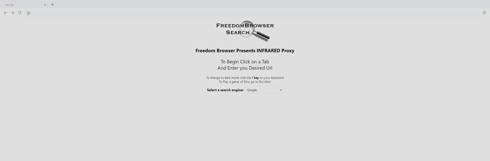
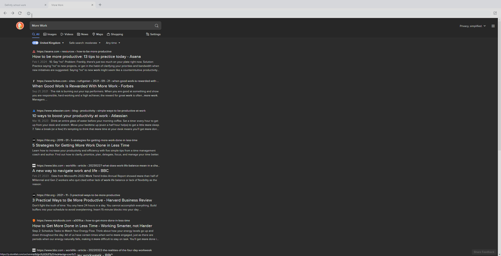
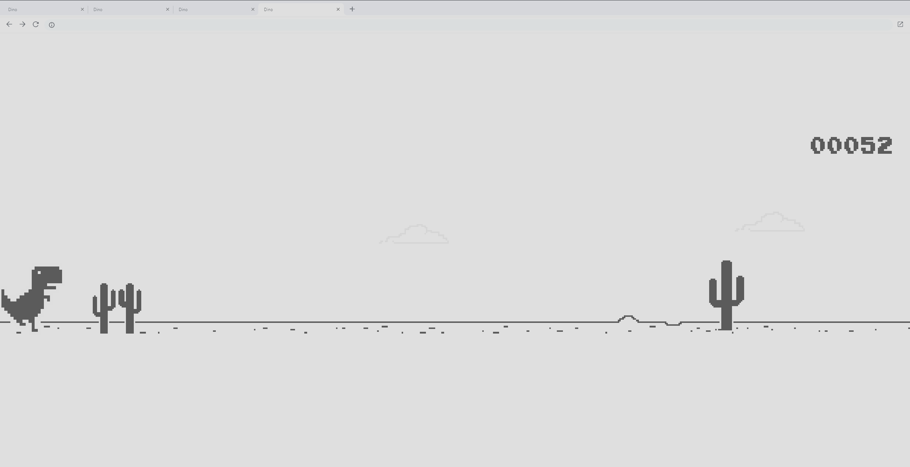
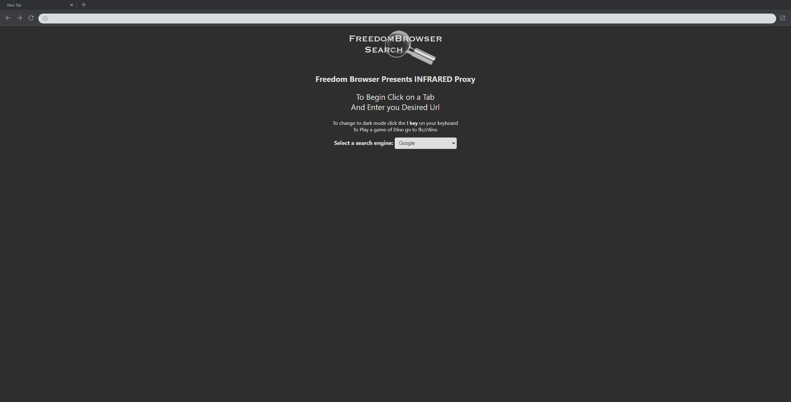

# Freedombrowser Browser v154
README.md NOT written by chat gpt "Trust me bro, i did not write this" ~ Chat-GPT 29/2/2023

## Description
This is a web browser application built using HTML, CSS, and JavaScript. It provides basic browsing functionalities such as opening new tabs, navigating to URLs, and refreshing pages.

## Features
- Open new tabs with customizable titles
- Navigate to URLs by entering them in the address bar
- Refresh pages using the refresh button
- Close tabs by clicking on the close button
- Grey out the weird line when clicking the info button

## Screenshots
### **Home Page:**

### **Different Search Engines:**

### **Dino game (fb://dino) :**

### **Dark Mode (! KEY) :**

## Credits
- This project is inspired by Rammerhead 
- Special thanks to Myself for my contributions

## License
This project is licensed under the [GNU General Public License v3.0](LICENSE).
